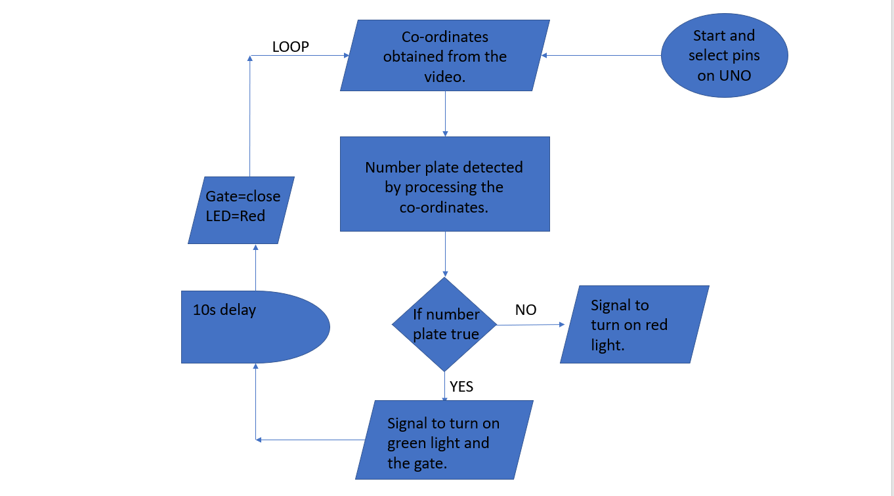
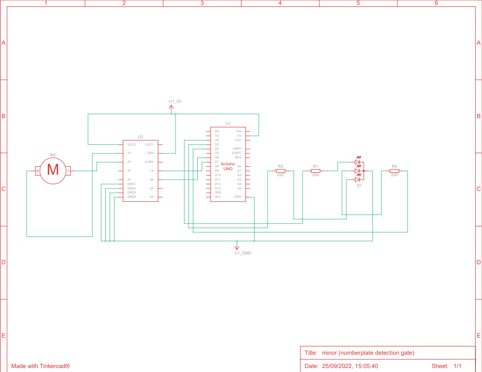

# Number_Plate_Detector

## Algorithm
1. start of program
2. selecting the pins used
3. in setup loop choose the output pins and input pins and establish the seriel comunication (9600)
4. in the infinite loop we take the video stream from camera
5. this video from camera is disected into frames of images.
6. these images will be processed using a ML model to find the number plate and the content on it
7. while number plate is visible and matches, the gate will be opened and green light will be turned on.
8. the gate will remain open till the car passes.
9. if the number plate is not detected the gate will be closed and red light will be turned 
10. repeat the infinite loop

## Flowchart

## List of Items
| Name       | Quantity | Component             |
|------------|----------|-----------------------|
| U1         | 1        | Arduino Uno R3        |
| U2         | 1        | H-bridge Motor Driver |
| M2         | 1        | Hobby Gearmotor       |
| D1         | 1        | LED RGB               |
| R1, R3, R4 | 3        | 220 Ω Resistor        |

## Schematic 

